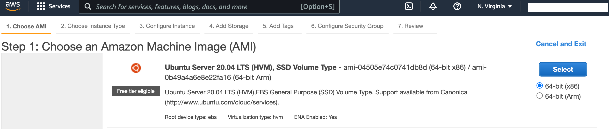
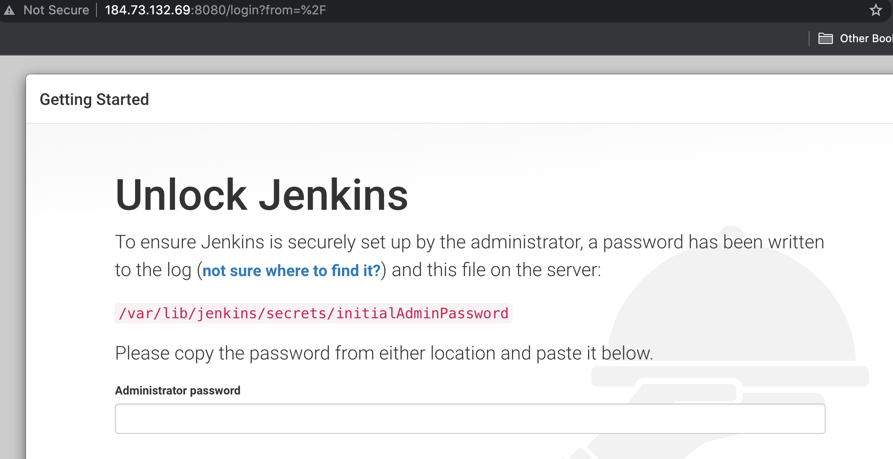
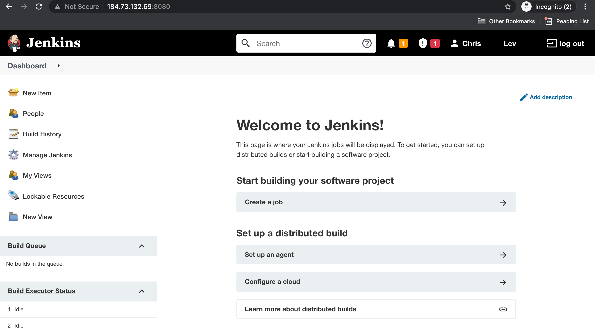
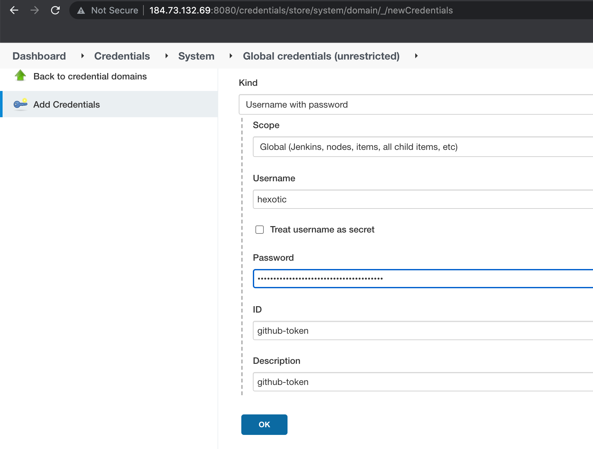
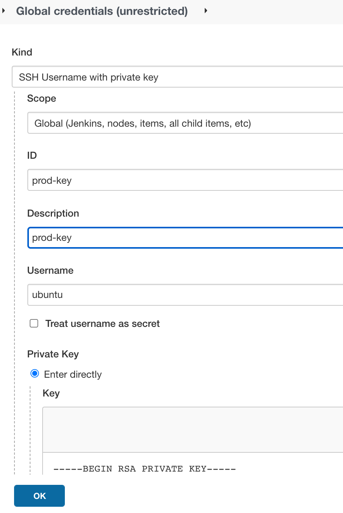
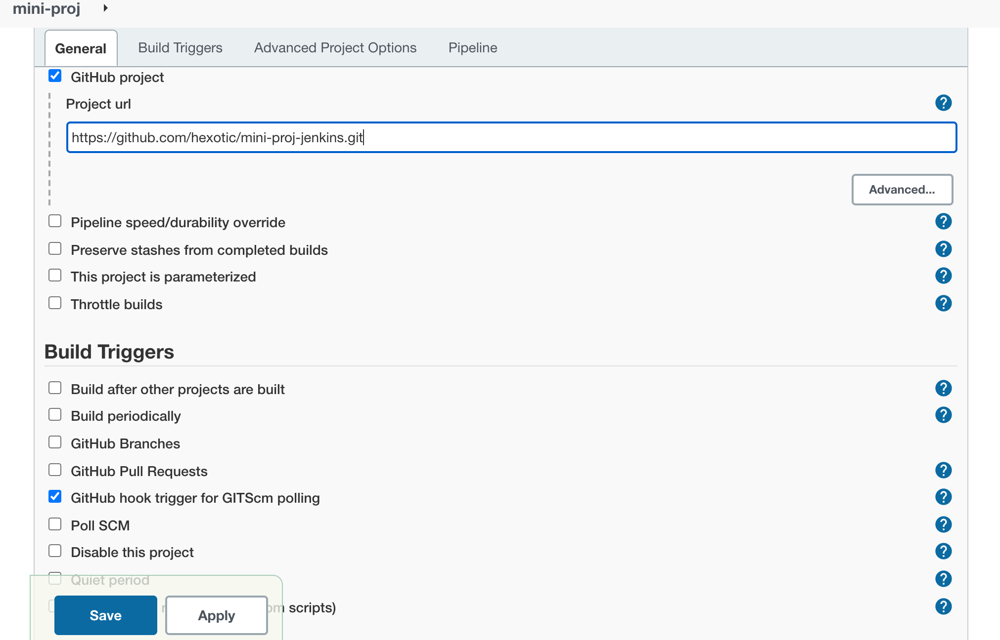
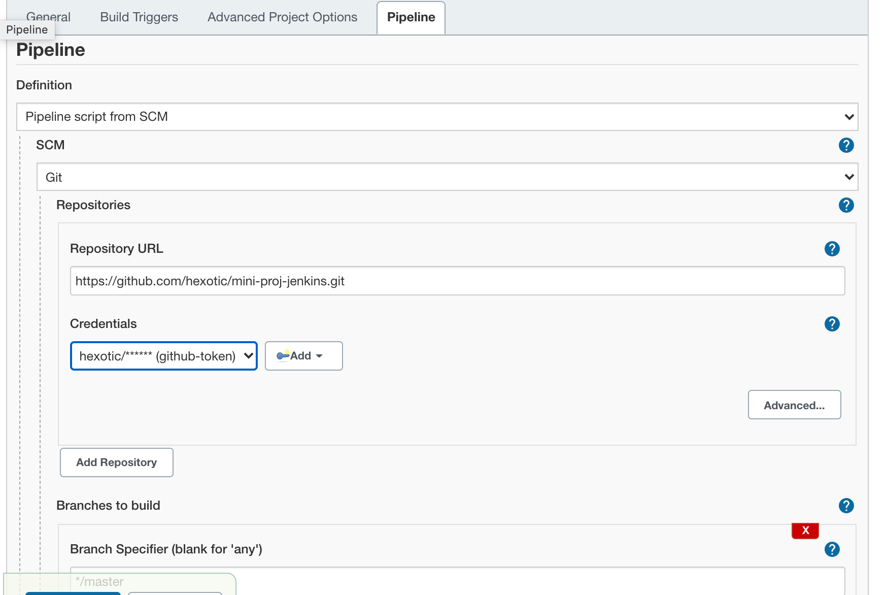
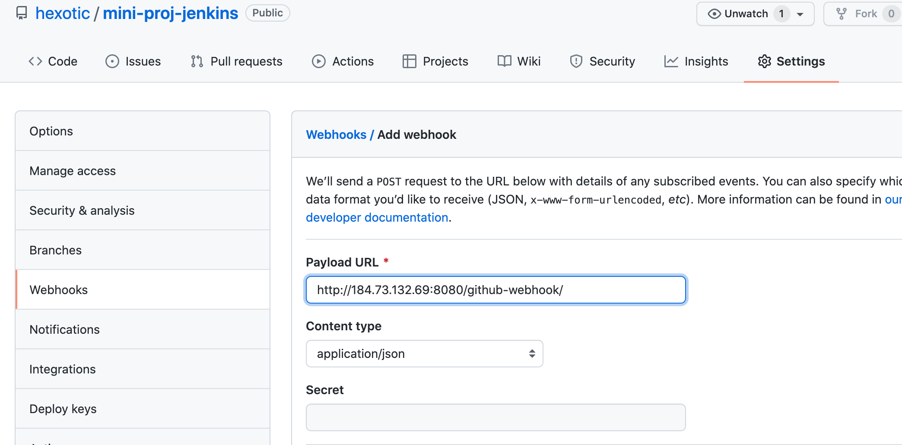
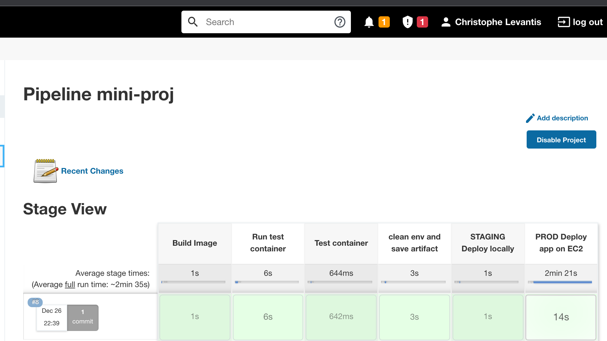
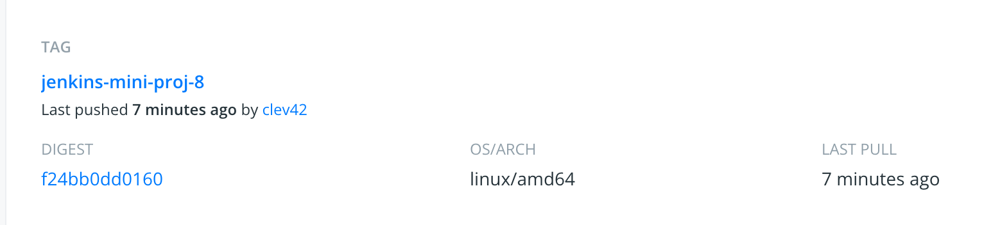

# Jenkins mini project

https://github.com/hexotic/mini-proj-jenkins

# Jenkins installation on AWS EC2

## EC2 configuration
Since Jenkins uses Java, it's best to have a VM running on a T2 large with a 20 GiB drive and with a public IP address.
For the AMI, I choose a Ubuntu 20.04 LTS.



I configured the Security Group to allow incoming traffic from:
* port 22 (ssh)
* port 80 (http)
* port 8080 (for jenkins)

## Jenkins installation
```sh
# Java installation
sudo apt install -y openjdk-11-jre-headless

# Jenkins installation
# From https://www.digitalocean.com/community/tutorials/how-to-install-java-with-apt-on-ubuntu-20-04#installing-specific-versions-of-openjdk
wget -q -O - https://pkg.jenkins.io/debian-stable/jenkins.io.key | sudo apt-key add -

sudo sh -c 'echo deb http://pkg.jenkins.io/debian-stable binary/ > /etc/apt/sources.list.d/jenkins.list'
sudo apt update
sudo apt install -y jenkins
sudo systemctl enable --now jenkins
sudo systemctl status jenkins
```

## Check installation
To check Jenkins is installed properly, I typed:
* http://184.73.132.69:8080/

I get the installation page:



## Finish installation
Get the password:
```sh
sudo cat /var/lib/jenkins/secrets/initialAdminPassword
```

Then click on **"Install suggested plugins"**

## Create first admin user
After creating the first admin user, Jenkins is ready to be used.



# Jenkins project set-up

## Docker
Since the pipeline will build a Docker image, Docker needs to be installed:
```shs
curl -fsSL https://get.docker.com -o get-docker.sh
sh get-docker.sh
sudo usermod -aG docker ubuntu
```
**Logout then login again to make the changes effective**

## Github

Before importing the github repository, we need the plugin **github integration**:

* Dashboard->manage jenkins-> Manage Plugin -> available -> type : github integration
* select then **install without restart**

## Access secrets
* github token
* docker hub token
* EC2 chris-ec2-prod : ssh key (specific to deployment)

### GitHub credential
* Go to Manage Jenkins -> Credentials -> click on global -> click on add credentials -> Kind **username with password**
* Fill fields with username and token



### Dockerhub credential
* Go to Manage Jenkins -> Credentials click on global -> click on add credentials -> Kind **secret text**
* Fill fields with token

### EC2 prod ssh key
* Go to Manage Jenkins -> Credentials click on global -> click on add credentials -> Kind **SSH username with private key**
* Select **Enter Directly**
(copy the private key which correspond to the key pair used to provision the prod EC2)




# Pipeline creation

## Create a Pipeline
* In Jenkins Dashboard: **New Item** then select **Pipeline**
* Click on **GitHub project**
* Enter GitHub URL
* Select Jenkins file



### Add webhook to GitHub
Go to GitHub repository. Click on ```Settings``` then select ```webhooks```.
Put the Jenkins URL.



## EC2 for production testing
Need to deploy a EC2 chris-ec2-prod with docker installed.

**EC2 user data**
```sh
#!/bin/bash
curl -fsSL https://get.docker.com -o get-docker.sh
sh get-docker.sh
usermod -aG docker ubuntu
```

# CI/CD
With all the previous steps completed, the pipeline succeeds.



We can see the image was pushed in DockerHub.


